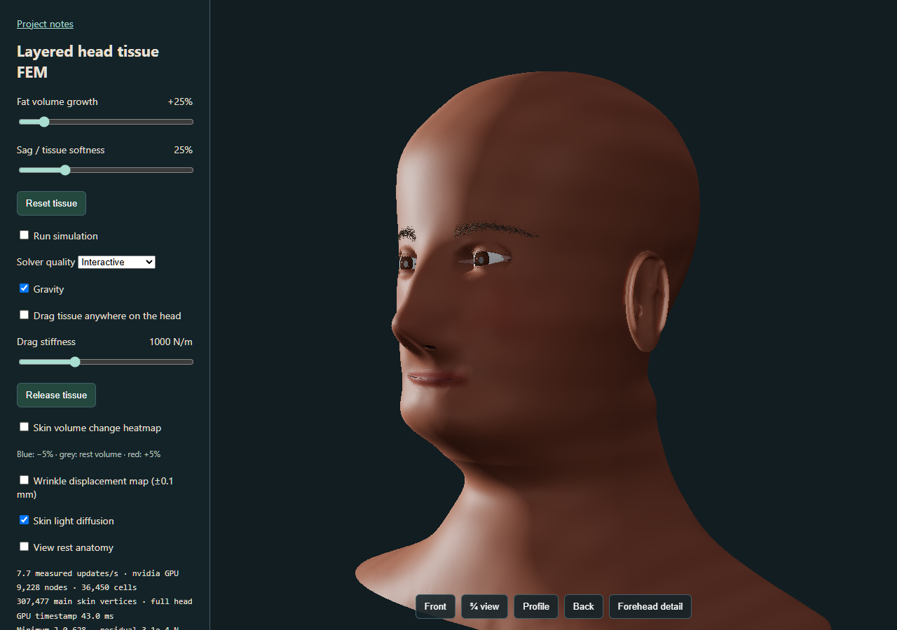

# First candidate: measured results

Selected baseline `4bc8b53a8f15b8b62cf6a86e` and candidate
`b98e5e355de988dda736084c` ran serially in fresh Edge contexts at
1280 x 900, device scale 1, Interactive quality, default diffusion, default
gravity and three-quarter view on an NVIDIA Lovelace adapter. HTTP cache was
disabled for each case. The same external native-map observer preserved the
original mapping promises. Each dynamic window followed static convergence
at authored 25% growth / 25% softness and a two-second dynamic warmup.
These controls are model parameters, not physiological interventions.

The candidate geometric query preserves the baseline normal override; the
candidate smooth query changes that normal path. Studio exactly matches the
baseline lighting. Side and overhead comparisons use identical candidate
presets. Actual paired side-light images illustrate the incremental shading
change:

| Geometric override | Transported smooth normal |
| --- | --- |
|  |  |

Smooth normals reduce small highlight breakup around lips/cheeks. Overall waxy
skin response, simplified eye/lid relationships and authored head proportions
remain. This is a modest correction, not a completed photorealistic upgrade.

| Case | Ready from navigation, ms | Solver updates / wall seconds | Simulation seconds | Map wait median / maximum, ms |
| --- | ---: | ---: | ---: | ---: |
| Baseline | 2816.8 | 391 / 12.007 | 6.517 | 11.8 / 482.4 |
| Candidate geometric | 1860.1 | 366 / 12.003 | 6.100 | 13.7 / 474.8 |
| Candidate smooth | 2288.0 | 376 / 12.005 | 6.267 | 13.7 / 464.5 |

This one ordered run demonstrates neither steady-state speedup nor general
startup speedup. Candidate startup requested no hidden anatomy; both candidate
cases exercised failure/uncheck and successful retry. A faster failure initially
exposed a Playwright `check()` postcondition race; the failure test now clicks
and observes the application's expected uncheck. No application tolerance or
candidate source changed to resolve that harness race.

All three simulations lagged wall time. Long asynchronous map waits remain;
their initiating driver/queue cause is not established. Render submissions and
solver updates are not display presentation FPS. GPU timestamp medians also
varied across the windows; those timestamps cover timed compute work rather
than every wait. Peak whole-viewer memory and physical Android remain unmeasured.

Maximum difference across 188 settled surface samples from the baseline was
0.0456 micrometres for candidate geometric and 1.215 micrometres for smooth.
This bounded tolerance check does not establish exact whole-state equivalence
or biological accuracy. Separate existing GPU/CPU parity checks passed:
dynamic maximum position error 3.137 nm, quasistatic 0.1003 micrometres,
GPU static residual 0.0005923 N and CPU residual 0.0006667 N.

Device-loss recovery preserved the checkpoint with zero measured position
error. The recovered CPU backend applied a new 60% growth request with positive
J and no application errors, but reached the existing 45-second solve cap;
that follow-up is not certified settled. The other eight retained browser
regressions were not rerun in this bounded slot. Six calibration contract tests,
offline model/worker checks and preserved 70-file deployment transport checks
passed separately. No physiological fitting or new tissue law was tested.

## Shared-device diagnostic

`shared_surface_probe.js` is not imported by the viewer. It evaluated all
307,477 main skin vertices directly from the solver's GPU packed-state buffer,
then rendered from the result on that same GPU device. Across 188 sampled
vertices in the initial gravitational preload and a passive load state,
maximum position error against double-precision transfer arithmetic was
32.365 nm and maximum normal-vector error was 2.316e-7. Owned buffer allocation
was 46,869,736 bytes. No GPU errors were recorded.

This establishes a bounded resident-transfer/device-sharing prototype. Its
Lambert diagnostic renderer excludes eyes, fine wrinkles, skin diffusion and
production shadows. The current solver still performs full correctness and
checkpoint readback. It supplies no measured production speedup, material
parity, asynchronous checkpoint recovery or complete picking bridge.

The selected public runtime remains unchanged. Keep the milestone draft while
the next material/eye and carefully versioned bridge candidates are prepared.
Raw host-specific QA output remains outside public source; only these reviewed
rendered images and summarized measurements are included.
